# Computational Geometry Applications
Labs for a University Course

## Setup

To run computer these vision applications you need to have **Python3.10**.

1. Clone repo:
```bash
git clone https://github.com/maksymshylo/computational_geometry.git
```
2. Create virtual environment.
```bash
python3.10 -m venv .venv
```
3. Activate it
```bash
source .venv/bin/activate
```
4. Install requirements:
```bash
pip install -r requirements.txt
```

## Lab 1 - Basic CV algorithms using opencv
### stereo on unaligned images

## Lab 2 - Disparity map calculation with Semi-Global Matching algorithm.

### Description
> The application calculates disparity map for **x** and **y** axes 
> with Semi-Global Matching algorithm.

### Usage

```commandline
$ python3 lab2/sgm_stereo.py --help
usage: sgm_stereo.py [-h] left_image right_image smoothing_coef min_dx max_dx min_dy max_dy

positional arguments:
  left_image      Path to left image
  right_image     Path to right image
  smoothing_coef  Smoothing coefficient for binary penalties
  min_dx          Min value for horizontal disparity
  max_dx          Max value for horizontal disparity
  min_dy          Min value for vertical disparity
  max_dy          Max value for vertical disparity
```

### Examples
```bash
python3 labs/lab2/sgm_stereo.py \
        --right_image test_images/teddy_right.png \
        --left_image test_images/teddy_left.png \
        --smoothing_coef 5 \
        --min_dx 0 \
        --max_dx 50 \
        --min_dy 0 \
        --max_dy 0
```


| Left image                      |           Right image            | Disparity map                        |
|---------------------------------|:--------------------------------:|--------------------------------------|
|  |  | 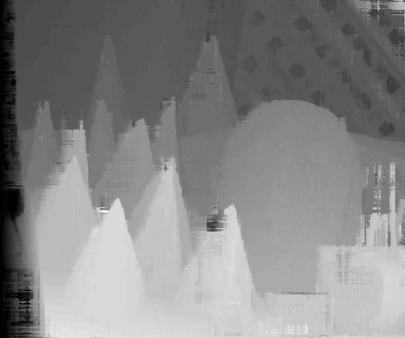 |


```bash
python3 labs/lab2/sgm_stereo.py \
        --right_image test_images/sofa_right.png \
        --left_image test_images/sofa_left.png \
        --smoothing_coef 5 \
        --min_dx 0 \
        --max_dx 20 \
        --min_dy 0 \
        --max_dy 20
```

| Left image                      |           Right image            | Disparity map                        |
|---------------------------------|:--------------------------------:|--------------------------------------|
|  |  | 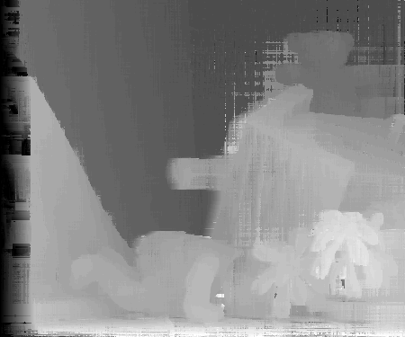 |


## Lab 3 - Image Stitching
### Description
> The application creates a panorama by applying homography transformation matrix.

### Usage

```commandline
$ python3 labs/lab3/homography.py --help
usage: homography.py [-h] --img1 IMG1 --img2 IMG2 --ransac_iter RANSAC_ITER --out_img OUT_IMG

options:
  -h, --help                show this help message and exit
  --img1 IMG1               path to img1
  --img2 IMG2               path to img2
  --ransac_iter RANSAC_ITER max iteration for ransac algorithm
  --out_img OUT_IMG         path to output image
```


#### Examples
```bash
python3 labs/lab3/homography.py \
        --img1 test_images/computer_1.png \
        --img2 test_images/computer_2.png \
        --ransac_iter 2000 \
        --out_img computer_stitched.png
```

| Left image                      |           Right image           | Stitched image                     |
|---------------------------------|:-------------------------------:|------------------------------------|
| 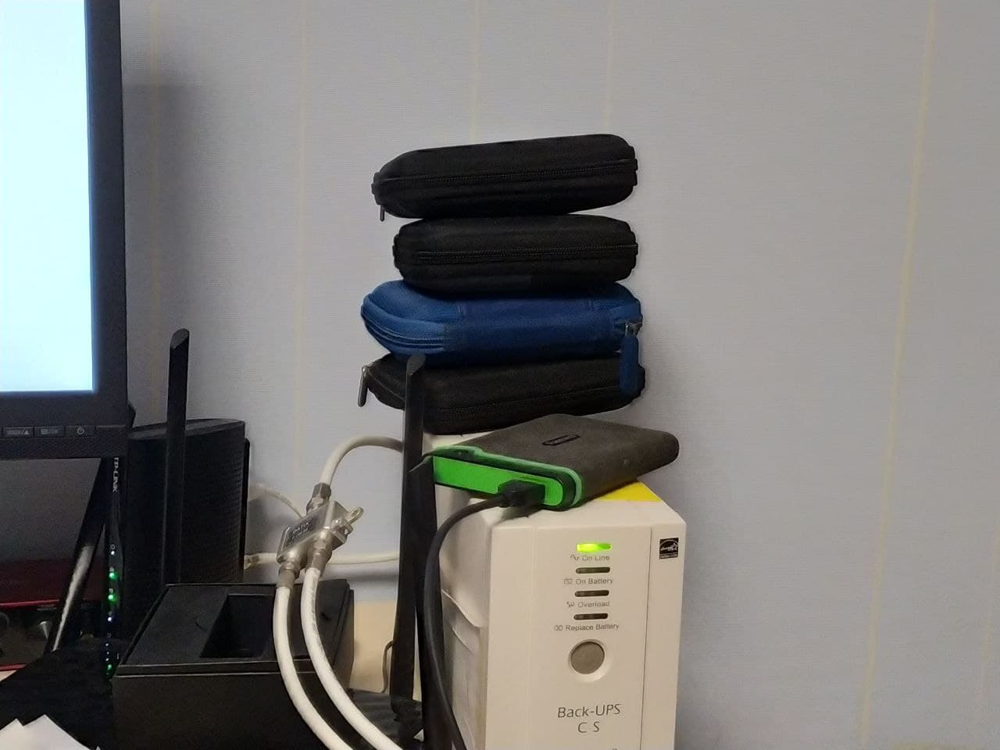 | 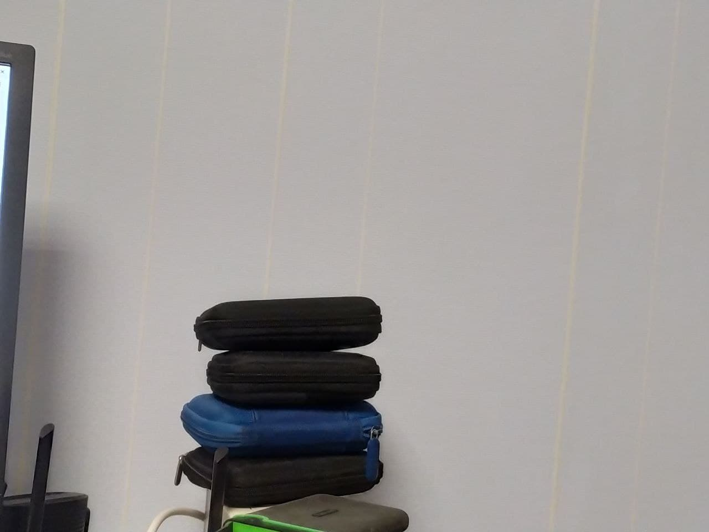 | 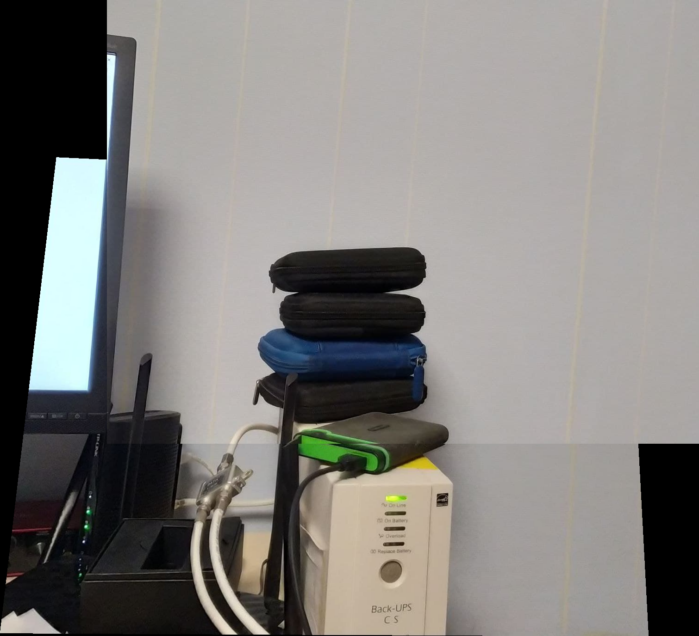 |


## Lab 4 - Panorama View with TRW-S

### Description
> The application creates a panorama by applying homography transformation matrix 
> and Tree Reweighted Message Passing (TRW-S) as a stitching method.

> **_Note_**: The first image for input is the base image for applying homography.

### Usage

```commandline
 $ python3 labs/lab4/trws_stitch.py --help
usage: trws_stitch.py [-h] --images-list IMAGES_LIST [IMAGES_LIST ...]
                      --n-iter-trws N_ITER_TRWS --out-img OUT_IMG

options:
  -h, --help                                   show this help message and exit
  --images-list IMAGES_LIST [IMAGES_LIST ...]  Image paths. First image is the Source image.
  --n-iter-trws N_ITER_TRWS                    Max iteration for TRWS algorithm
  --out-img OUT_IMG                            Path to stitched image.
```

### Examples
```bash
python3 labs/lab4/trws_stitch.py \
        --images-list test_images/book2.jpg test_images/book1.jpg test_images/book3.jpg \
        --n-iter-trws 5 \
        --out-img book_stitched_trws.png
```

| The first image            |      The second image      | The third image            | Stitched image                     |
|----------------------------|:--------------------------:|----------------------------|------------------------------------|
| 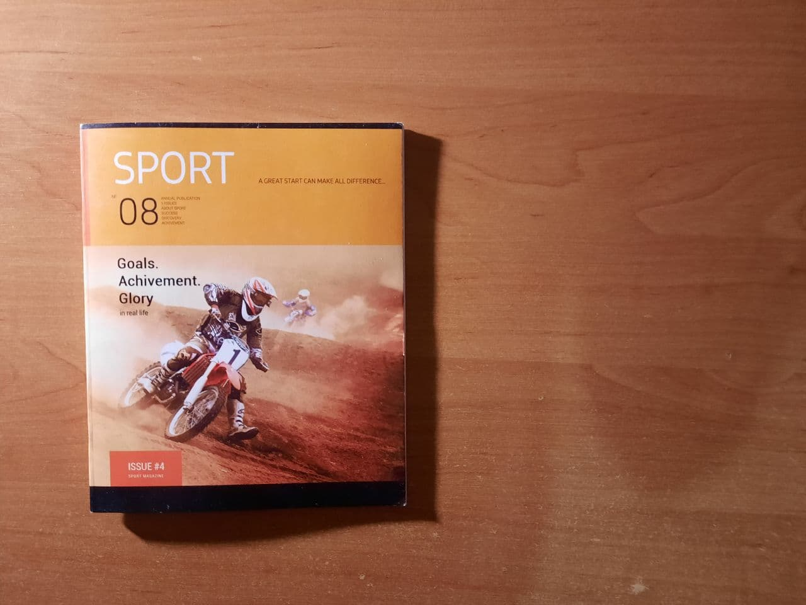 | 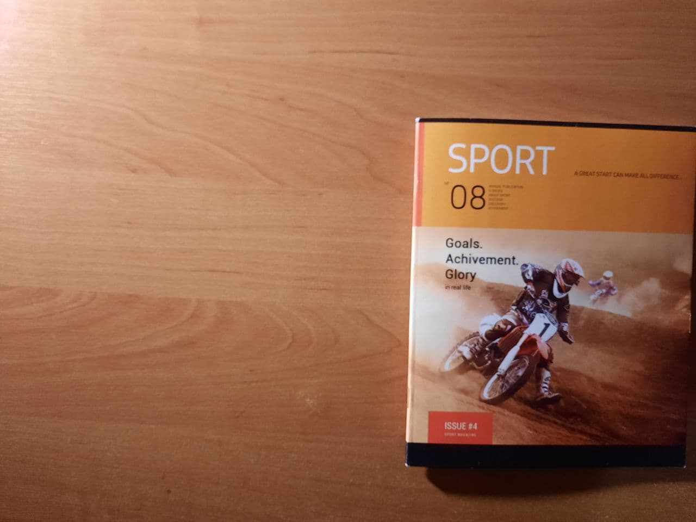 | 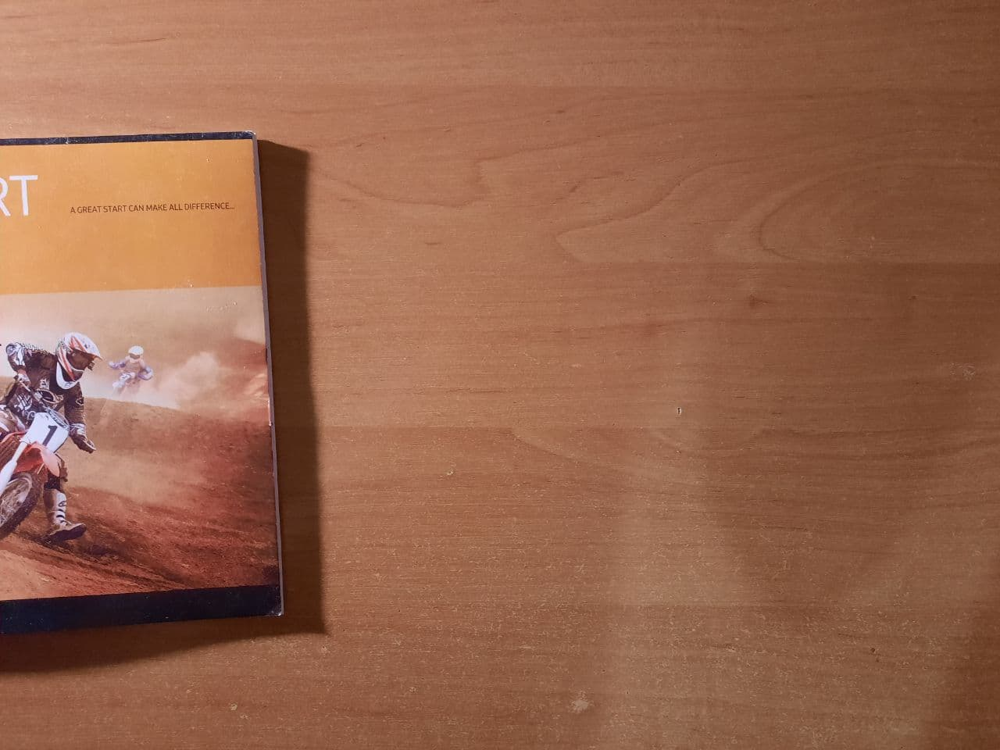 | 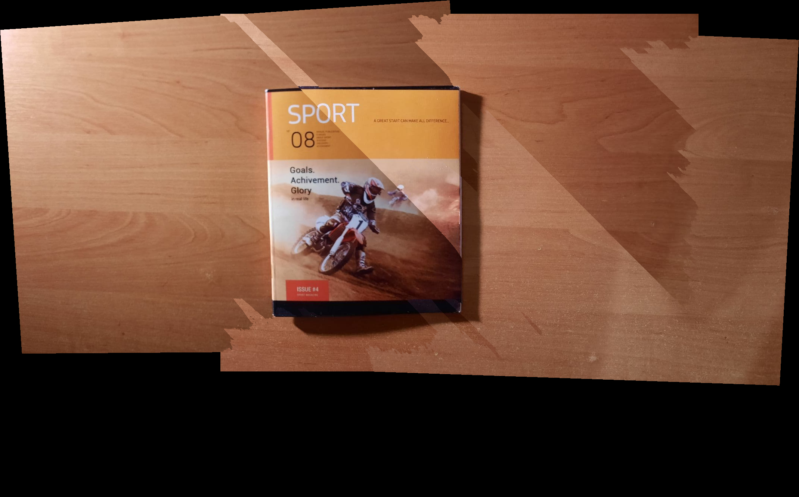 |


```bash
python3 labs/lab4/trws_stitch.py \
        --images-list test_images/ball2.jpg test_images/ball3.jpg test_images/ball1.jpg \
        --n-iter-trws 5 \
        --out-img ball_stitched_trws.png
```

| The first image            |      The second image      | The third image            | Stitched image                      |
|----------------------------|:--------------------------:|----------------------------|-------------------------------------|
| 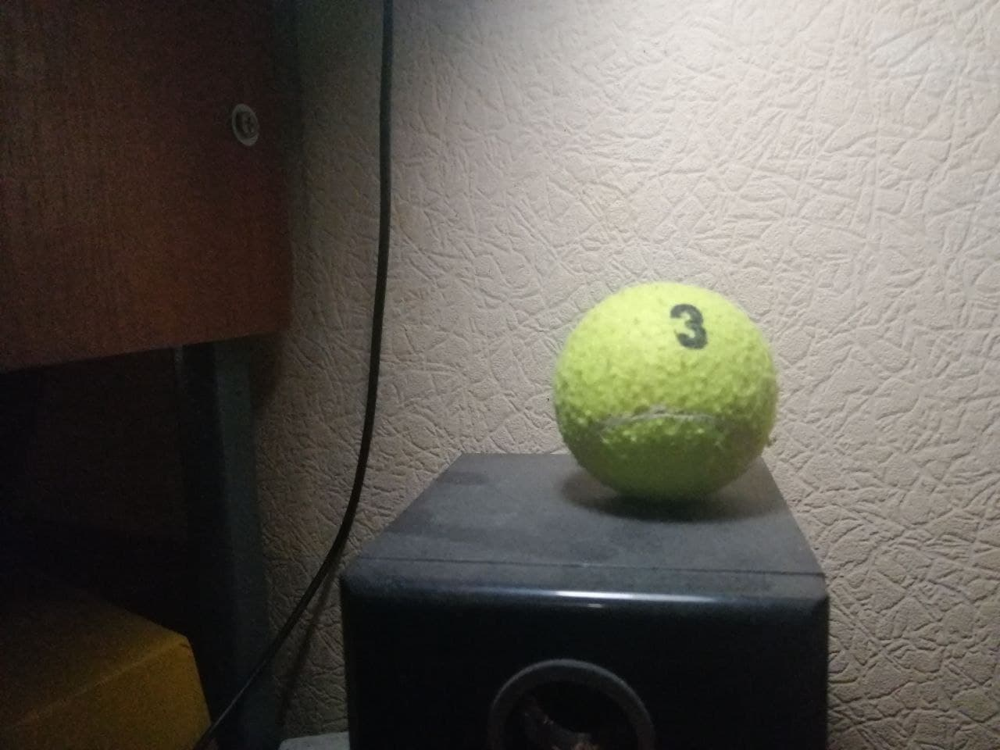 | 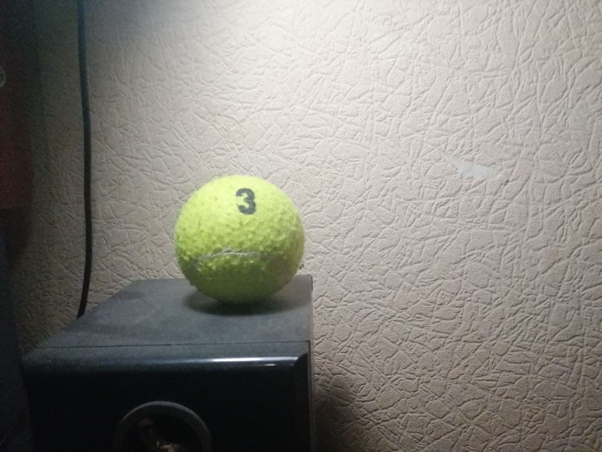 | 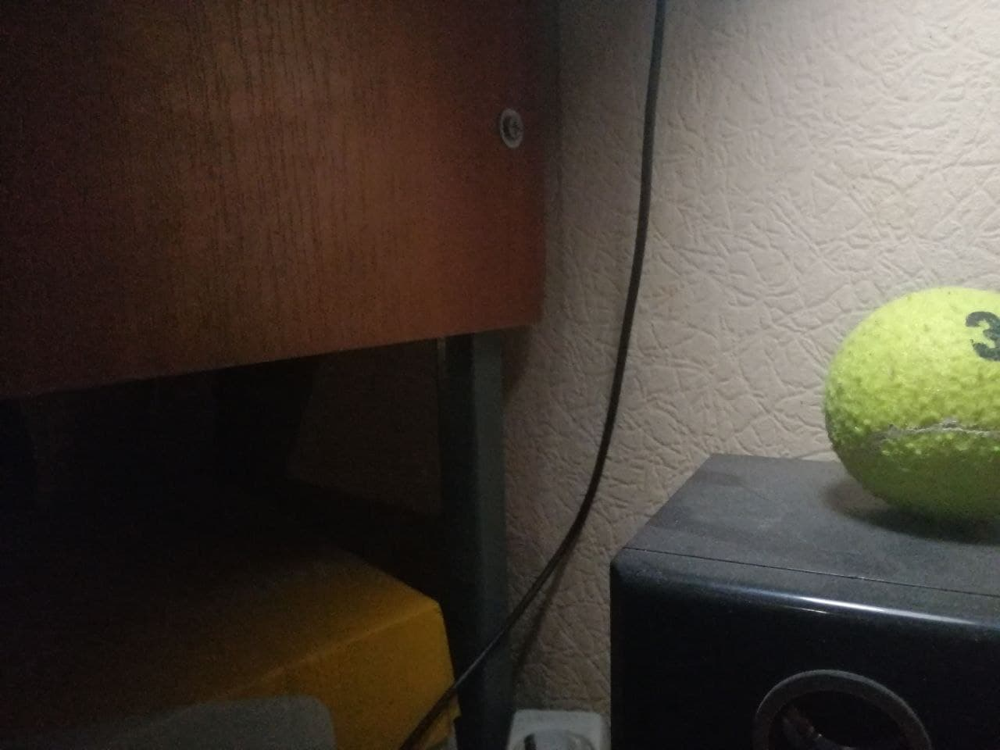 | 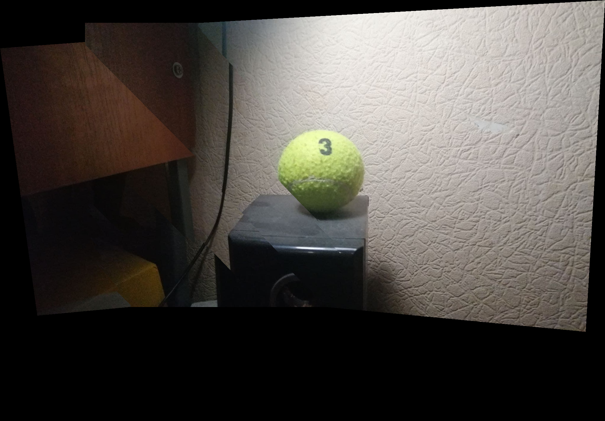 |


## Lab 5 - Finding Fundamental Matrix With 7-point Algorithm (RANSAC)

### Description
> The application calculates the best fundamental matrix with 7-point Algorithm.

> **_Note_**: The first image for input is the base image for applying homography.

### Usage

```commandline
 $ python3 labs/lab5/fundamental_matrix.py --help
usage: fundamental_matrix.py [-h] left_image right_image epsilon n_iter

positional arguments:
  left_image   Left image
  right_image  Right image
  epsilon      Threshold parameter in PIXELS
  n_iter       Number of iterations
```

### Examples

```bash
python3 labs/lab5/fundamental_matrix.py \
        --left_image test_images/bike1.jpeg \
        --right_image test_images/bike2.jpeg \
        --epsilon 1 \
        --n_iter 1000
```
| The first image                                          |                     The second image                     |
|----------------------------------------------------------|:--------------------------------------------------------:|
| 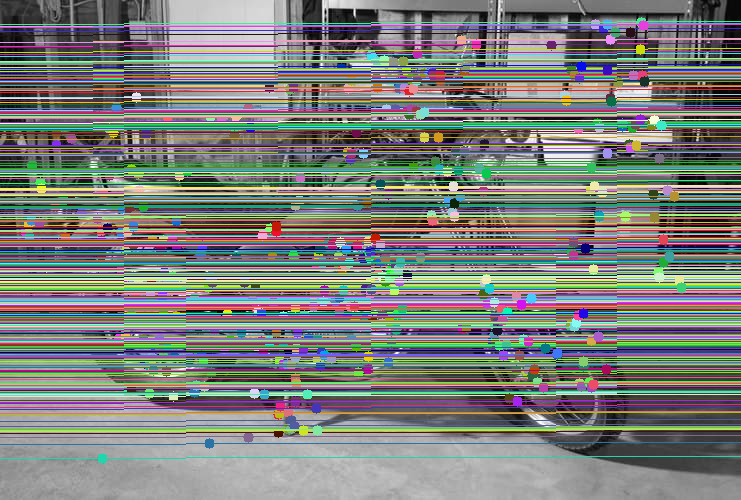 | 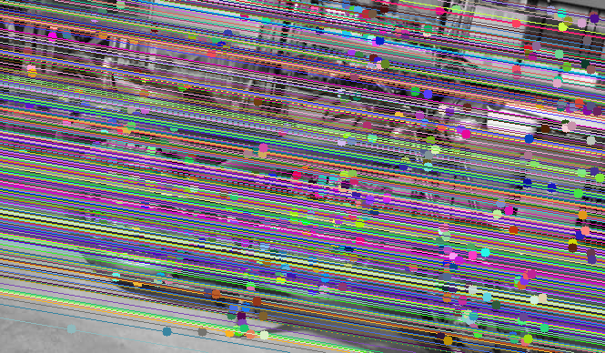 |

```bash
python3 labs/lab5/fundamental_matrix.py \
        --left_image test_images/mount1.jpeg \
        --right_image test_images/mount2.jpeg \
        --epsilon 1 \
        --n_iter 1000
```

| The first image                                           |                     The second image                      |
|-----------------------------------------------------------|:---------------------------------------------------------:|
| 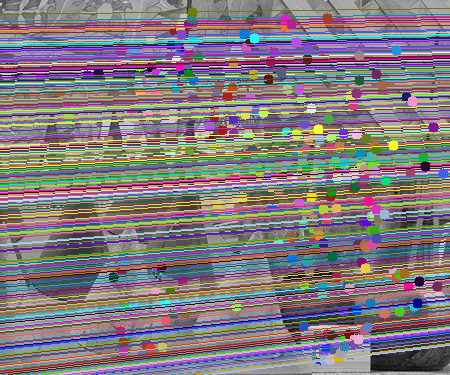 | 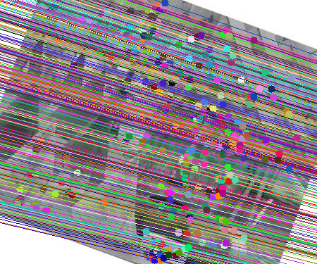 |

```bash
python3 labs/lab5/fundamental_matrix.py \
        --left_image test_images/messL.png \
        --right_image test_images/messR.png \
        --epsilon 1 \
        --n_iter 1000
```

| The first image                                          |                     The second image                     |
|----------------------------------------------------------|:--------------------------------------------------------:|
| 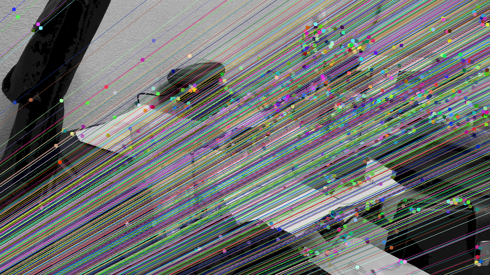 | 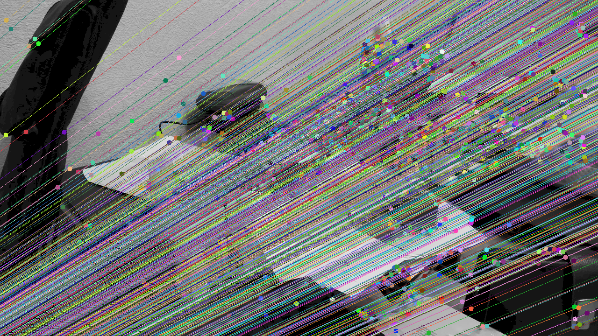 |


## Lab 6 - Finding Essential Matrix with Fundamental Matrix and Camera Intrinsics Parameters

### Description
> The application calculates essential matrix for 2 images.

### Usage

```commandline
$ python3 labs/lab6/essential_matrix.py --help
usage: essential_matrix.py [-h] [--left_image LEFT_IMAGE] [--right_image RIGHT_IMAGE] [--epsilon EPSILON] [--n_iter N_ITER]
                           [--pixel_size PIXEL_SIZE]

options:
  -h, --help                show this help message and exit
  --left_image LEFT_IMAGE   left input image
  --right_image RIGHT_IMAGE right input image
  --epsilon EPSILON         threshold parameter in PIXELS
  --n_iter N_ITER           number of iterations for RANSAC fundamental matrix finding
  --pixel_size PIXEL_SIZE   size of pixel in microns
```

### Examples

```bash
 python3 labs/lab6/essential_matrix.py \
           --left_image labs/lab6/test_images/left.jpeg \
           --right_image labs/lab6/test_images/right.jpeg \
           --epsilon 1 \
           --n_iter 1000 \
           --pixel_size 0.8
```
output
```commandline
Finding Essential matrix.
Input
     Fundamental matrix:  
 [[-6.91974362e-09  3.82229878e-07 -3.72199828e-04]
 [ 3.40310473e-07 -4.92928196e-08 -2.91128152e-03]
 [-3.43488734e-04  1.76278676e-03  1.00000387e+00]]
     Intrinsic matrix:  
 [[5.75e+03 0.00e+00 1.50e+03]
 [0.00e+00 5.75e+03 1.50e+03]
 [0.00e+00 0.00e+00 1.00e+00]]
  

Step 1. Calculating essential matrix.
essential_matrix = intrinsic_matrix.T @ fundamental_matrix @ intrinsic_matrix =  
 [[ -0.22878402  12.63747533   1.09690089]
 [ 11.25151503  -1.62974385 -14.2298415 ]
 [  0.90043483  13.00760602  -0.29703359]]
  

Step 2. Make singular value decomposition of the essential_matrix.
U, S, Vh = np.linalg.svd(essential_matrix)
U  
 [[-0.51093267 -0.46986081 -0.71984625]
 [ 0.72682224 -0.68325893 -0.0699047 ]
 [-0.4589959  -0.55891686  0.6906046 ]]
S  
 [1.90609931e+01 1.73054248e+01 1.36128410e-14]
Vh  
 [[ 0.41348573 -0.71412181 -0.5648536 ]
 [-0.46710611 -0.69888418  0.54163898]
 [ 0.78156345 -0.03988658  0.6225493 ]]
  

Step 3. Updating sigma to have sigma1=sigma2>0 and sigma3=0
S1 = (S[0] + S[1]) * 0.5 * np.identity(3); S1[-1, -1] = 0
np.diagonal(S1):   
 [18.18320898 18.18320898  0.        ]
  

Step 4. Updating essential matrix
updated_essential_matrix = U @ S1 @ Vh.T =  
 [[ 2.2597089  10.31057155 -6.92025951]
 [14.3367462   2.50956919 10.82465637]
 [ 3.80659049 11.00116769 -6.11757954]]
  

Check rank of essential matrix: rank(updated_essential_matrix) =  2
Check essential matrix constraint: 
0 = det(E) =  3.94798984843875e-13
0 = 2 * E @ E.T @ E - trace(E @ E.T ) * E = 
 [[ 4.09272616e-12  4.54747351e-12 -9.09494702e-13]
 [-1.81898940e-12  3.63797881e-12 -4.54747351e-12]
 [ 3.63797881e-12  4.54747351e-12 -4.54747351e-13]]
  

Calculating translation vector
translation_vector = ((S1[0, 0] + S1[1, 1]) * 0.5) * det(U) * Vh.T[2, :]   
 [-10.27085107   9.84873469  11.31994399]
  

Calculating rotation matrix
W = [[ 0  1  0]
     [-1  0  0]
     [ 0  0  1]]
rotation_matrix = det(U) * U @ W @ Vh.T * det(Vh.T) =  
 [[-0.96575665  0.25228888  0.06053438]
 [ 0.19703588  0.8649821  -0.46150063]
 [-0.16879264 -0.43376986 -0.88507217]]
```
| The first image                                              |                       The second image                       |
|--------------------------------------------------------------|:------------------------------------------------------------:|
|  |  |


